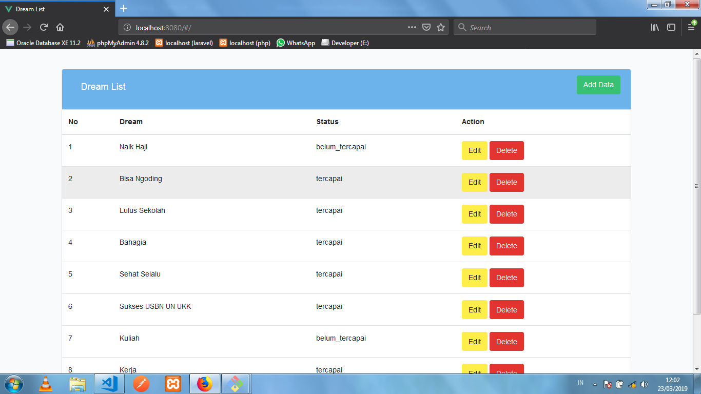
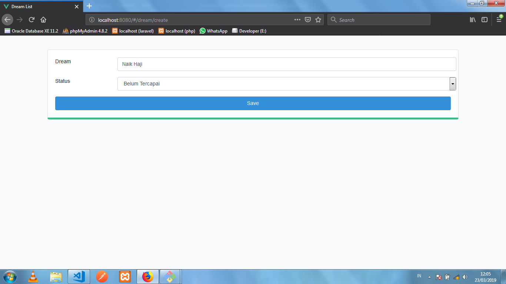
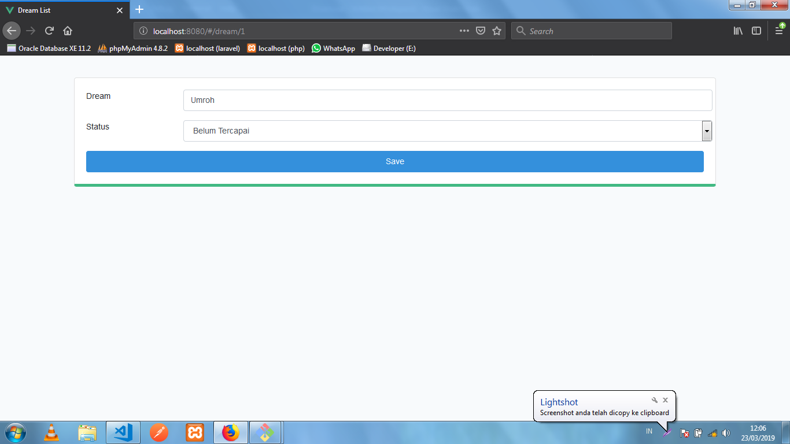
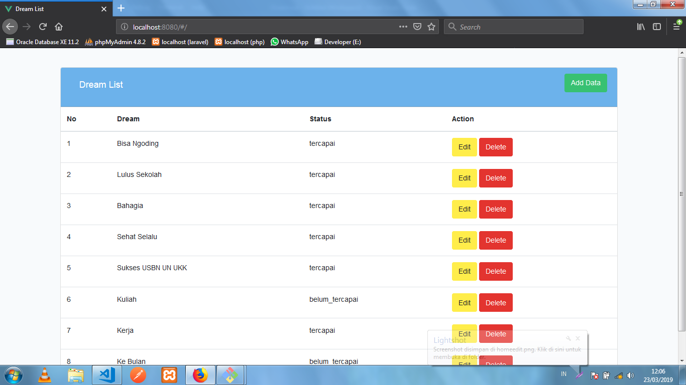

# dreamlist
Aplikasi Pencatat Daftar Keinginan / Mimpi Menggunakan Lumen &amp; Vue.JS
Nama : Rian Maulana Kelas : XII RPL 2

##Penjelasan Aplikasi
  * Halaman Read 
  Menampilkan semua data dreamlist yang tersimpan di database
  
  
  * Halaman Create
  Membuat dreamlist yang baru
  
  
  * Halaman Edit
  Mengubah dreamlist yang ada
  
  
  * Delete
  Menghapus dreamlist yang ada
  

## Yang Harus Diinstall
  * XAMPP Versi Terbaru
  * Composer
  * Postman

## Cara Menginstall
  * Clone <a>https://github.com/rianmau-lana/dreamlist/</a> ke komputer anda
  * Buka cmd / terminal, masuk ke file yang sudah di clone tadi di cmd dan masukkan <code>$ composer install</code>
  * Buat file bernama .env dengan menyalin dari file .env.example
  * Buat database dengan nama <code>db_dream_list</code>  dan juga tambahkan <code>DB_DATABASE=db_dream_list</code> di file .env
  * Ketik <code>$ php artisan migrate</code>  di cmd / terminal

## Cara Menjalankan 
  * ketik <code>$ npm run dev</code> di file <code>dreamlist/frontend</code>
  * ketik <code>$ php -S localhost:3000 -t public</code> di file <code>dreamlist</code>
  * buka browser dan ketik <code>localhost:8080</code> di browser
